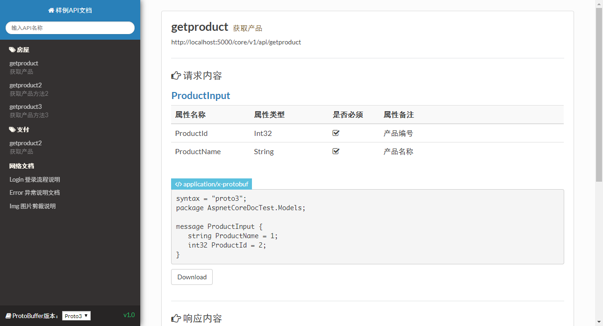
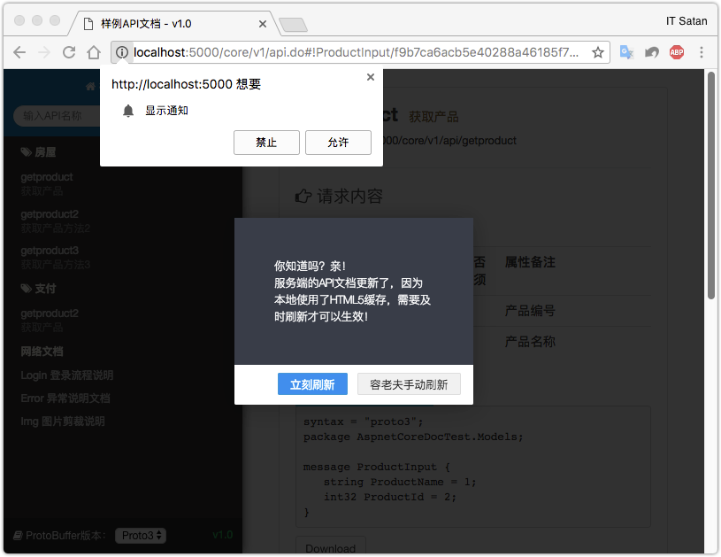

# 关于

[](https://travis-ci.com/li-keli/AspnetCoreApiDoc)

[](https://img.shields.io/badge/AspnetCoreApiDoc.version-v3.0.2-green.svg)

[

[

API文档自动生成，用于对APP端的开发帮助文档生成，默认`ProtoBuffer`传输格式。

本项目并不是`RESTful`风格，是面向功能的API类型。APiDoc的作用是根据定义好的API接口和注释来自动生成给内部开发者提供的API对接文档。

# Nuget下载

`Install-Package AspnetCoreApiDoc`

# 关于ProtoBuffer

官方描述：

> Protocol buffers are a language-neutral, platform-neutral extensible mechanism for serializing structured data.

# 交流

* Bugs: [Issues](https://github.com/li-keli/AspnetCoreApiDoc/issues)
* Gitter: [Gitter channel](https://gitter.im/AspnetCoreApiDoc/AspNetCoreApiDoc)

# 生成文档示例






# 说明文档

**NO.1**

引用项目后，在`Startup.cs`中的`ConfigureServices`方法加入如下代码，进行服务注册：

```c#
    //注册API文档服务
    services.AddProtoMvc(op =>
    {
        op.IsOpenDoc = true; // 开放文档访问
        op.ApiOptions = new ApiOptions
        {
            //API文档访问的路由; 推荐和API地址访问保持一致
            DocRouter = "/core/v1",
            ApiName = "样例API文档",
            APiVersion = "v1.0",
            Copyright = "Copyright©2018-2011 api.com All Rights Reserved. ",
            ProtoBufVersion = ProtoBufEnum.Proto3,
            NetworkDocs = new List<NetworkDoc>
            {
                new NetworkDoc
                {
                    Title = "默认网络文档一",
                    Url = "https://www.baidu.com/"
                },
                new NetworkDoc
                {
                    Title = "我的博客",
                    Url = "http://www.cnblogs.com/likeli/"
                },
            }
        };
        //此处配置ES日志服务地址
        //op.ESOptions = new ESOptions
        //{
        //    Uri = "http://192.168.0.1:9200",
        //    DefaultIndex = "test-log",
        //};
    });
```

**NO.2**

在`Configure`方法启用服务：

```c#
    app.UseStatusCodePages()
        .UseApi();  //启用API文档生成
```

**NO.3**

在需要生成API文档的控制器`Controller``或`方法`Action`上添加`ApiDoc`特性标记

例如：

`Controller`上添加：
```c#
    [ApiDoc, Route("core/v1/[controller]/[action]/")]
    public class ApiController
    {
        ...
    }
```

`Action`上添加：
```c#
    /// <summary>
    /// 获取产品方法2
    /// </summary>
    /// <param name="input">输入参数</param>
    /// <returns>输出参数</returns>
    [ApiDoc, HttpPost]
    public ProductInput GetProduct2([FromBody] ProductInput input)
    {
        return new ProductInput {ProductName = "一体机"};
    }
```

在controller上添加ApiDoc特性后，可以在该控制器下的action上再添加`ApiDoc(false)`来停止某个单独方法的文档生成

**NO.4**

给API的项目和所有其依赖的项目的`.csproj`文件中的`Project`节点下都加上生成XML的配置，如下:

```C#
  <PropertyGroup>
    <TargetFramework>netcoreapp2.0</TargetFramework>
    <DocumentationFile>bin\Debug\netcoreapp2.0\{项目名}.xml</DocumentationFile>
    <DocumentationFile>bin\Release\netcoreapp2.0\{项目名}.xml</DocumentationFile>
    <NoWarn>1701;1702;1705;1591</NoWarn>
  </PropertyGroup>
```

**NO.5**

> 通过游览器打开`http://localhost:5000/core/v1/api.do`来访问API文档

完整实例：

```c#
    public class Startup
    {
        public Startup(IConfiguration configuration)
        {
            Configuration = configuration;
        }
    
        public IConfiguration Configuration { get; }
    
        public void ConfigureServices(IServiceCollection services)
        {
            //加载日志记录组件
            services.AddSingleton<IHttpContextAccessor, HttpContextAccessor>();
            services.AddSingleton<ESClientProvider>();
    
            //注册API文档服务
            services.AddProtoMvc(op =>
            {
                op.IsOpenDoc = true; // 开放文档访问
                op.ApiOptions = new ApiOptions
                {
                    //API文档访问的路由; 推荐和API地址访问保持一致
                    DocRouter = "/core/v1",
                    ApiName = "样例API文档",
                    APiVersion = "v1.0",
                    Copyright = "Copyright©2018-2011 api.com All Rights Reserved. ",
                    ProtoBufVersion = ProtoBufEnum.Proto3,
                    NetworkDocs = new List<NetworkDoc>
                    {
                        new NetworkDoc
                        {
                            Title = "默认网络文档一",
                            Url = "https://www.baidu.com/"
                        },
                        new NetworkDoc
                        {
                            Title = "我的博客",
                            Url = "http://www.cnblogs.com/likeli/"
                        },
                    }
                };
                //此处配置ES日志服务地址
                //op.ESOptions = new ESOptions
                //{
                //    Uri = "http://192.168.0.1:9200",
                //    DefaultIndex = "test-log",
                //};
            });
        }
    
        // This method gets called by the runtime. Use this method to configure the HTTP request pipeline.
        public void Configure(IApplicationBuilder app, IHostingEnvironment env, ILoggerFactory loggerFactory)
        {
            //启动ES日志服务
            //loggerFactory
            //    .AddESLogger(app.ApplicationServices, "test-log", new FilterLoggerSettings
            //    {
            //        {"*", LogLevel.Trace},
            //        {"Microsoft", LogLevel.Warning},
            //        {"System", LogLevel.Warning},
            //    });
            app.UseStatusCodePages()
                .UseApi(); //启用API文档生成
        }
    }
```

# 其他工具

在tool目录下提供了批量下载proto文件的工具`apiprotoasnic.go`，基于go编写，源代码很简单，就是解析json，这里不再单独的提供说明文档。

# 约定

* 所有API的方法传入参数必须从Body中读取

# 版权

本项目采用 MIT 开源授权许可证
